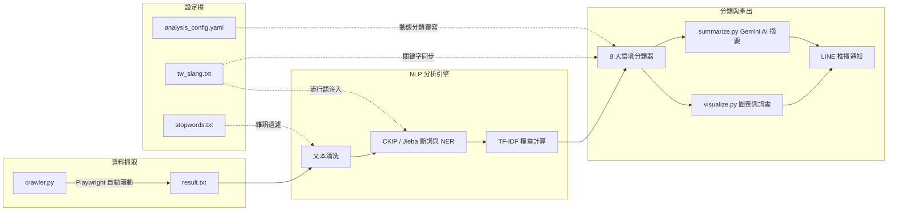

# Threads 流行趨勢分析工具

自動化的 Threads 社群趨勢洞察系統。涵蓋資料抓取、自然語言處理、AI 摘要生成、視覺化圖表產出，以及 LINE 即時推播通知。

---

## 系統架構



---

## 核心功能

- **AI 智慧摘要** — 整合 Google Gemini API，自動產出今日話題懶人包與策略建議。
- **高精準 NLP 引擎** — 預設使用中研院 CKIP 進行實體辨識 (NER)，精準區分人物、作品與地點。
- **8 大語境分類** — 自動將趨勢關鍵字歸類至體育、感情、職場、科技、ACG、美食、旅遊、影視等板塊。
- **數據視覺化** — 自動產出熱門趨勢長條圖與詞雲圖。
- **LINE 即時通報** — 將分析結果直接推送至手機。

---

## 快速開始

### 1. 安裝套件

```bash
pip install -r requirements.txt
```

### 2. 設定環境變數

根據 `.env.example` 建立 `.env` 檔案，填入以下金鑰：

```
GEMINI_API_KEY=<your_key>
LINE_CHANNEL_ACCESS_TOKEN=<your_token>
LINE_USER_ID=<your_id>
```

### 3. 資料抓取

```bash
python web-spider/src/crawler.py
```

啟動後會開啟瀏覽器，請手動登入 Threads。登入完成後回到終端機按 Enter，爬蟲將自動滾動並抓取貼文。抓取結果會儲存至 `result.txt`。

### 4. 執行分析

```bash
# 全功能模式：CKIP 分析 + AI 摘要 + 圖表 + LINE 推播
python analyze.py --line

# GPU 加速模式
python analyze.py --line --device cuda
```

### 5. 查看結果

- **終端機** — 即時輸出分類趨勢報告與 AI 摘要。
- **輸出檔案** — `outputs/word_tfidf.csv`（結構化數據）、`outputs/visuals/*.png`（圖表）。
- **手機** — 檢查 LINE 通知。

---

## 指令參考

### analyze.py

主程式，負責文本分析、分類、AI 摘要與通知推播。

#### 基本參數

| 參數 | 縮寫 | 預設值 | 說明 |
|---|---|---|---|
| `--input` | `-i` | `result.txt` | 指定輸入檔案路徑。檔案內容應為爬蟲抓取的原始貼文。 |
| `--top` | `-n` | `30` | 輸出排名前 N 的關鍵字數量。 |
| `--minlen` | | `2` | 關鍵字最短長度，低於此長度的詞彙將被過濾。 |
| `--debug` | | 關閉 | 開啟除錯模式，輸出詳細的中間處理資訊。 |

#### NLP 引擎

| 參數 | 預設值 | 說明 |
|---|---|---|
| `--engine` | `ckip` | 選擇 NLP 引擎。`ckip` 精準度較高，支援 NER 實體辨識；`jieba` 速度較快、不需 GPU，適合快速預覽。 |
| `--ckip-level` | `1` | CKIP 模型等級。`1` = albert-tiny（最快）、`2` = albert-base、`3` = bert-base（最精準但最慢）。 |
| `--device` | `cpu` | CKIP 推論裝置。設為 `cuda` 可啟用 GPU 加速，也可指定裝置編號如 `cuda:0`。 |
| `--user-dict` | 無 | 指定額外的 Jieba 自訂詞典檔案路徑。系統預設會自動載入 `config/tw_slang.txt`。 |

#### 文本過濾

| 參數 | 預設值 | 說明 |
|---|---|---|
| `--pos-only` | 關閉 | 僅保留名詞類詞性的詞彙（透過 Jieba 詞性標註判斷）。 |
| `--min-doc-tokens` | `3` | 每篇貼文的最低有效詞彙數，低於此值的短貼文將被排除。 |
| `--min-chinese-ratio` | `0.2` | 每篇貼文的最低中文字元比例 (0 到 1)，用於過濾純外語或亂碼貼文。 |

#### 片語探勘

| 參數 | 預設值 | 說明 |
|---|---|---|
| `--top-phrases` | `15` | 輸出排名前 N 的熱門片語數量。 |
| `--phrase-min-freq` | `3` | 片語候選詞的最低出現頻率，低於此次數的組合不列入。 |
| `--phrase-pmi-min` | `3.0` | 片語的最低 PMI（逐點互資訊量）閾值，用於篩選統計上顯著的詞組搭配。 |

#### 去重複

| 參數 | 預設值 | 說明 |
|---|---|---|
| `--no-dedupe` | 關閉 | 停用近似重複貼文偵測。預設會透過 SimHash 演算法自動移除內容高度相似的貼文。 |
| `--dedupe-hamming` | `3` | SimHash 去重複的最大漢明距離。值越小判定越嚴格，值越大容許更多差異。 |

#### AI 與通知

| 參數 | 縮寫 | 預設值 | 說明 |
|---|---|---|---|
| `--ai` | | 開啟 | 加上此旗標會關閉 Gemini AI 自動摘要功能。需在 `.env` 中設定 `GEMINI_API_KEY`。 |
| `--line` | `-l` | 關閉 | 分析完成後將趨勢報告與圖表透過 LINE Messaging API 推送至手機。需在 `.env` 中設定 `LINE_CHANNEL_ACCESS_TOKEN` 與 `LINE_USER_ID`。 |
| `--no-progress` | | 關閉 | 隱藏推論進度條，適合在 CI/CD 或非互動環境中使用。 |

#### 使用範例

```bash
# 最簡模式：使用預設設定分析 result.txt
python analyze.py

# 完整模式：GPU 加速 + LINE 推播
python analyze.py --line --device cuda

# 快速預覽：使用 Jieba 引擎，不執行 AI 摘要
python analyze.py --engine jieba --ai

# 自訂輸入檔案與關鍵字數量
python analyze.py --input data/custom.txt --top 50

# 高精準 CKIP 模型 + 更嚴格的去重複
python analyze.py --ckip-level 3 --dedupe-hamming 2 --device cuda
```

### visualize.py

單獨執行視覺化模組，從已產出的分析結果重新繪製圖表。

```bash
python visualize.py
```

### crawler.py

啟動 Playwright 瀏覽器進行 Threads 資料抓取。

```bash
python web-spider/src/crawler.py
```

執行後會開啟 Chromium 瀏覽器視窗。手動登入 Threads 帳號後，回到終端機按 Enter 即可開始自動滾動抓取。抓取過程中會定期儲存進度，避免中途中斷導致資料遺失。

---

## 設定檔說明

| 檔案 | 用途 |
|---|---|
| `config/analysis_config.yaml` | 雜訊過濾規則、英文白名單、動態分類覆寫 (`category_overrides`) |
| `config/tw_slang.txt` | 台灣流行語字典，同時作為 Jieba 自訂詞典與分類關鍵字來源 |
| `config/stopwords.txt` | 停用詞黑名單 |